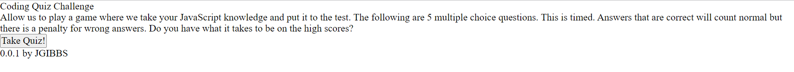
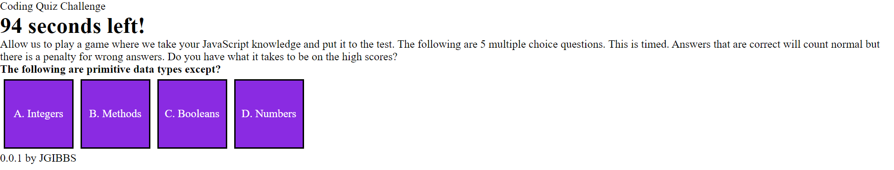
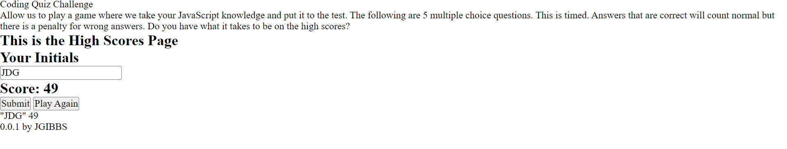

# Assignment: 04 Challenge Code Quiz

## Description

The application is a quiz that generates a pre-set list of questions. The quiz is timed with a set deduction if questions are answered incorrectly. The remaining time is the final score which can be recorded with text. The game can be replayed.

## Screenshot

## Link
GitHub Repository: https://github.com/1-those-jacks/code-quiz 
GitHub Page: https://1-those-jacks.github.io/code-quiz/
